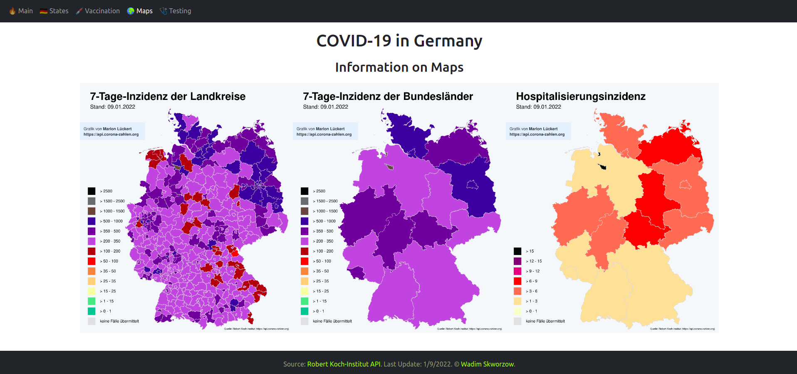

# COVID-19 in Germany: Statistic Overview

The project uses [Robert Koch-Institut COVID-19 API von Marlon Lückert](https://api.corona-zahlen.org/docs/) as the content basis.

The project showcases the most important information by states and maps of Germany, about vaccination and testing.

## Live Version:

[Live Version on Netlify](covid19-info-sempris.netlify.app)

Known issues: 404 page does not work with Netlify (automatically changed by the service).

## Used Technologies:

- React JS
- React-Bootstrap
- 3rd-party API fetching
- Browser Routing